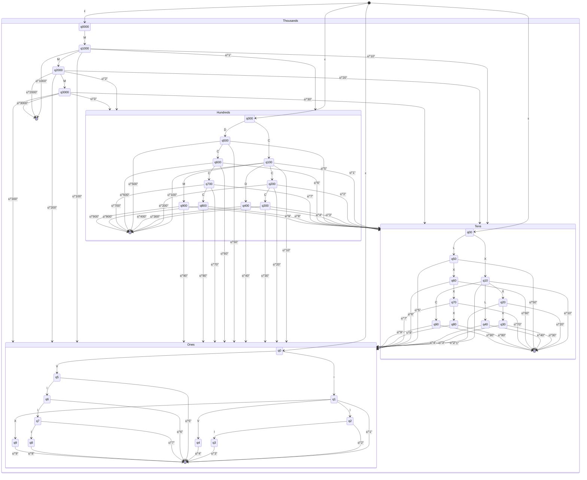

```mermaid
stateDiagram-v2
    [*] --> q0: ε
    [*] --> q00: ε
    [*] --> q000: ε
    [*] --> q0000: ε

    state Ones {
        q0 --> q1: I
        q1 --> q2: I
        q2 --> q3: I
        q1 --> q4: V
        q0 --> q5: V
        q5 --> q6: I
        q6 --> q7: I
        q7 --> q8: I
        q1 --> q9: X

        q1 --> [*]: ε/"1"
        q2 --> [*]: ε/"2"
        q3 --> [*]: ε/"3"
        q4 --> [*]: ε/"4"
        q5 --> [*]: ε/"5"
        q6 --> [*]: ε/"6"
        q7 --> [*]: ε/"7"
        q8 --> [*]: ε/"8"
        q9 --> [*]: ε/"9"
    }

    state Tens {
        %% direction LR
        q00 --> q10: X
        q10 --> q20: X
        q20 --> q30: X
        q10 --> q40: L
        q00 --> q50: L
        q50 --> q60: X
        q60 --> q70: X
        q70 --> q80: X
        q10 --> q90: C

        q10 --> Ones: ε/"1"
        q20 --> Ones: ε/"2"
        q30 --> Ones: ε/"3"
        q40 --> Ones: ε/"4"
        q50 --> Ones: ε/"5"
        q60 --> Ones: ε/"6"
        q70 --> Ones: ε/"7"
        q80 --> Ones: ε/"8"
        q90 --> Ones: ε/"9"

        q10 --> [*]: ε/"10"
        q20 --> [*]: ε/"20"
        q30 --> [*]: ε/"30"
        q40 --> [*]: ε/"40"
        q50 --> [*]: ε/"50"
        q60 --> [*]: ε/"60"
        q70 --> [*]: ε/"70"
        q80 --> [*]: ε/"80"
        q90 --> [*]: ε/"90"
    }

    state Hundreds {
        direction LR
        q000 --> q100: C
        q100 --> q200: C
        q200 --> q300: C
        q100 --> q400: D
        q000 --> q500: D
        q500 --> q600: C
        q600 --> q700: C
        q700 --> q800: C
        q100 --> q900: M

        q100 --> Tens: ε/"1"
        q200 --> Tens: ε/"2"
        q300 --> Tens: ε/"3"
        q400 --> Tens: ε/"4"
        q500 --> Tens: ε/"5"
        q600 --> Tens: ε/"6"
        q700 --> Tens: ε/"7"
        q800 --> Tens: ε/"8"
        q900 --> Tens: ε/"9"

        q100 --> Ones: ε/"10"
        q200 --> Ones: ε/"20"
        q300 --> Ones: ε/"30"
        q400 --> Ones: ε/"40"
        q500 --> Ones: ε/"50"
        q600 --> Ones: ε/"60"
        q700 --> Ones: ε/"70"
        q800 --> Ones: ε/"80"
        q900 --> Ones: ε/"90"

        q100 --> [*]: ε/"100"
        q200 --> [*]: ε/"200"
        q300 --> [*]: ε/"300"
        q400 --> [*]: ε/"400"
        q500 --> [*]: ε/"500"
        q600 --> [*]: ε/"600"
        q700 --> [*]: ε/"700"
        q800 --> [*]: ε/"800"
        q900 --> [*]: ε/"900"
    }

    state Thousands {
        q0000 --> q1000: M
        q1000 --> q2000: M
        q2000 --> q3000: M

        q1000 --> Hundreds: ε/"1"
        q2000 --> Hundreds: ε/"2"
        q3000 --> Hundreds: ε/"3"

        q1000 --> Tens: ε/"10"
        q2000 --> Tens: ε/"20"
        q3000 --> Tens: ε/"30"

        q1000 --> Ones: ε/"100"
        q2000 --> Ones: ε/"200"
        q3000 --> Ones: ε/"300"

        q1000 --> [*]: ε/"1000"
        q2000 --> [*]: ε/"2000"
        q3000 --> [*]: ε/"3000"
    }
```